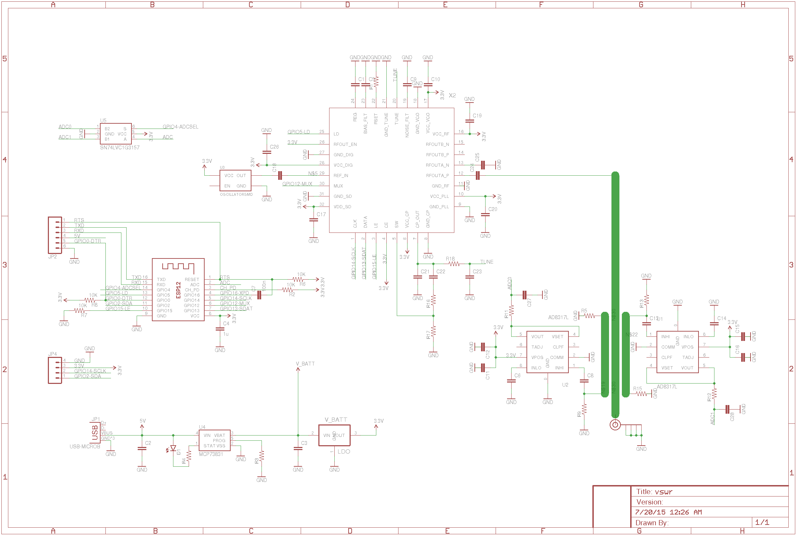
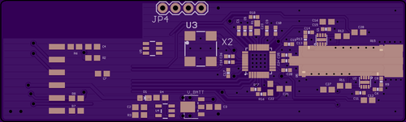
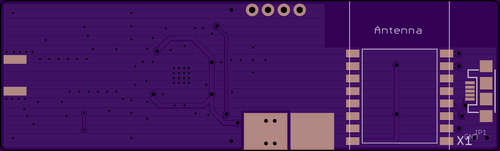
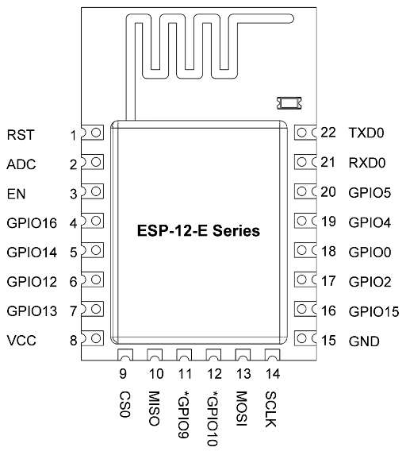

# VSWR
VSWR / Return loss analyzer

## Schematic

## PCB

### Top

### Bottom

## Parts

### Directional coupler

### RMS Power Detector
LTC5587

Name                                             | $     | Frequency     | Input Range    | Package  | Interface
------------------------------------------------ | ----- | ------------- | -------------- | -------- | ---------
[LMH2110TM](http://www.digikey.com/short/tc024d) | 2.30  | 50MHz ~ 8GHz  | -40dBm ~ 5dBm  | 6-WFBGA  | analog
[LTC5531](http://www.digikey.com/short/tc02f4)   | 3.07  | 300MHz ~ 7GHz | -32dBm ~ 10dBm | SOT-23-6 | analog
[AD8317](http://www.digikey.com/short/t7rp3d)    | 9.75  | 1MHz ~ 10GHz  | -53dBm ~ -3dBm | 8-VFDFN  | analog
[AD8319](http://www.digikey.com/short/tc02hf)    | 4.84  | 1MHz ~ 10GHz  | -43dBm ~ -3dBm | 8-VFDFN  | analog
[LTC5587](http://www.digikey.com/short/tc02dt)   | 11.03 | 10MHz ~ 6GHz  | -34dBm ~ 6dBm  | 12-WFDFN | SPI

### RF Synthesizer/VCO

Name                                           | $     | Frequency        | Package | Interface
---------------------------------------------- | ----- | ---------------- | ------- | ---------
[MAX2871](http://www.digikey.com/short/t7rz2d) | 11.12 | 23.5 .. 6000 MHz | TQFN-32 | SPI
[LMX2592](http://www.digikey.com/short/3j1prr) | 36.72 | 20 .. 9800 MHz   | WQFN-40 | SPI
[LMX2582](http://www.digikey.com/short/3j1p25) | 20.49 | 20 .. 5500 MHz   | WQFN-40 | SPI

### WiFi interface
[ESP8266 SMD board](http://www.electrodragon.com/w/ESP8266_SMD_Board) board $4

[ESP-12E](http://www.electrodragon.com/product/esp-12e-esp8266-wifi-board/) / [ESP-13](http://www.electrodragon.com/product/esp-13-esp8266-wifi-board/)

### Power
